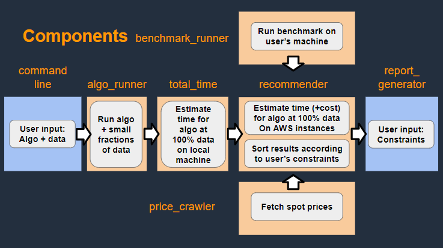
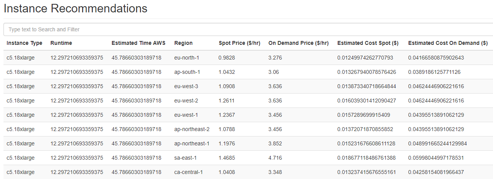

## Software Components

### Component 1: (algo_runner)
Input (.py file, dataset)  
If dataset.rows <= 10,000:  
Run the .py file against 1%, 5%, 10% of dataset  
Else:  
Run the .py file against 1,000, 5,000, 10,000 rows  
Return time taken to run the .py file against the three datasets  

### Component 2: (total_time)
Input (runtime per percent of total rows(default is 1%, 5%, 10%) and the row percents, from Component 2)  
Fit four optimized curves to the data points using scipy:  
- Linear  
- Exponential  
- Logn
- nLogn
Choose the function with the best fit (smallest residuals)

Output (expected total time on 100% data)

### Component 3: (benchmark_runner)  
Input (none)  
Run known benchmark on user computer(training of keras' percreptron on a full mnist dataset)  
Return (benchmark runtime)  

### Component 4: (price_crawler)
Input (None)  
API connection to AWS real-time EC2 prices  
Return (Price per hour of each instance in on-demand and spot priceing service)  

### Component 5: (recommender)
Input (Times to run benchmark file on users machine from Component 2, expected total time from Component 3, time taken for the benchmark on AWS from Component 4, and EC2 spot prices from Component 5)  
Create a dataframe of EC2 instances with added expected time and expected cost columns

Output (Dataframe with cost and time estimates)  

### Component 6: (report_generator)
Input(Dataframe with time and cost estimates per instance, generated by Component 5: recommender)
Final results output:  
Output (A sortable HTML table consisting of instances with their associated costs and times).
---

---
### Components interaction
1. User passes string that will be used to call the user's algorithm. String contains data_loc = <data csv path>, target_loc = <target csv path>, and any other parameters.
2. algo_runner takes in the string. Subsets the data and target into small fractions and run user's algorithm on small sets of data. algo_runner returns the fractions of data used to run, and their respective runtime.
3. total_time takes in this information and fit a curve through the data points. This is used to estimate the time user's algorithm will take to run at 100% of the data. total_time_component returns this estimate.
4. Meanwhile, benchmark_runnner runs a predetermined menchmark test on user's computer. benchmark_runner retuns runtime of this benchmark test on user's computer.
5. Meanwhile, aws_pricing crawls Amazon AWS API for spot and on demand prices at that moment.
6. recommender takes in the output from total_time_component(3), benchmark_runner(4), and aws_pricing(5) to merge them all into one dataframe together with our own benchmark dataset on various AWS instance tpyes. This dataframe is passed to the report_generator.
7. report_generator takes the dataframe and builds a table of estimated time and cost to run uset's algorithm on various AWS instance types. This table is then returned as a HTML wile which allows users to sort and filter according to user's constraints.

---
### The Output
The HTML file created by report_generator:

